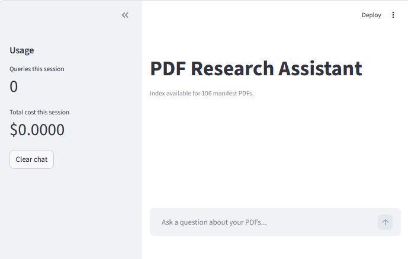

# PDF Research Assistant


A local PDF Research Assistant built with [PaperQA2](https://github.com/Future-House/paper-qa), backed by either a manifest-controlled document library or all PDFs under a chosen root folder.



> **Important**
> PaperQA2 uses retrieval-augmented generation (RAG). It returns real sources and real page references while still sometimes overstating, paraphrasing, or extrapolating beyond what the source explicitly says. Treat answers as a starting point for exploration, not as a citable summary. Always verify important claims against the source passages and the original PDF.

## Getting Started

### Requirements

- Python 3.11 or newer
- An OpenAI API key

Install the Python dependencies:

```bash
cd ~/gitrepos/pdf-research-assistant
pip install -r requirements.txt
```

Create an OpenAI API key in the OpenAI dashboard:

- [https://platform.openai.com/api-keys](https://platform.openai.com/api-keys)

### First-Time Setup

1. Copy `.env.example` to `.env`.
2. Set `OPENAI_API_KEY` in `.env`.
3. Set `PAPER_DIR` in `.env` to the common root folder containing your PDFs.
4. Optional: copy `manifest.example.csv` to `manifest.csv` if you want curated scope and metadata.
5. If you use `manifest.csv`, replace the example rows with paths relative to your chosen `PAPER_DIR`.

## Usage

### Streamlit UI

```bash
cd ~/gitrepos/pdf-research-assistant
streamlit run pdf_research_assistant.py
```

Streamlit will open the app in your browser automatically and will also print the local URL in the terminal. It usually uses `http://localhost:8501` unless that port is already in use.

The Streamlit sidebar shows:

- query count for the current session
- total session cost
- a button to clear the chat

Each assistant response also includes:

- a `Copy answer` button that copies the full answer text to the clipboard on Windows
- a `Show source passages` expander with the retrieved evidence passages used for the answer

On first use, there is no search index yet. The first query will build it, and for a large PDF library this can take a significant amount of time.

Each question is run in an isolated helper process so repeated questions in the same session do not reuse unstable async state.

### CLI

```bash
cd ~/gitrepos/pdf-research-assistant
python query_papers.py
```

Type a question at the prompt to search your indexed PDFs and return a cited answer with page references. Type `quit` to exit.

Like the Streamlit app, the CLI runs each question in a fresh helper process to avoid cross-query async issues.

### Rebuild the Index

```bash
cd ~/gitrepos/pdf-research-assistant
python rebuild_index.py
```

Use this when:

- running the project for the first time and you want to build the index explicitly
- you add new PDFs and want to rebuild before querying again
- you want a terminal-only indexing run instead of letting the first query build the index

On a clean rebuild, seeing `Manifest PDFs: <n>` and `Indexed before run: 0` is expected before indexing starts.

See `useful-commands.example.md` for PowerShell commands that help check index build progress and troubleshoot rebuild issues. If you want a version with your own local paths ready to copy and paste, create `useful-commands.md` from it.

## Configuration

The app and CLI read configuration from environment variables and will also load values from `.env` when present.

By default, `INDEX_DIR` and `MANIFEST_PATH` are resolved relative to the repository root, so the project can be moved without changing code.
`PAPER_DIR` can point to any folder on your system. If `manifest.csv` is present, it stores paths relative to that one common PDF root. If `manifest.csv` is absent, the app will index all PDFs under `PAPER_DIR`.

| Variable | Purpose | Default |
| --- | --- | --- |
| `OPENAI_API_KEY` | OpenAI API key for PaperQA2 queries | unset |
| `PAPER_DIR` | Common root folder containing your PDFs | required |
| `INDEX_DIR` | Optional override for where the local PaperQA index is stored | `<repo-root>/index` |
| `MANIFEST_PATH` | Optional CSV manifest of allowed PDFs | `<repo-root>/manifest.csv` |
| `PDF_RESEARCH_ASSISTANT_SYNC_DIR` | Optional destination folder for post-push copies of `.env`, `manifest.csv`, and your private `useful-commands.md` notes | unset |

See `.env.example` for the expected keys. Leave `INDEX_DIR` and `MANIFEST_PATH` unset if you want to use the repo-root defaults.

If `PDF_RESEARCH_ASSISTANT_SYNC_DIR` is set, the tracked `post-push` hook copies `.env` and `manifest.csv` when present. It also copies `useful-commands.md` if you have created a private local version for yourself.

## Notes

- The search index is stored in the folder set by `INDEX_DIR`.
- If `manifest.csv` exists, the app uses it to decide which PDFs are in scope and which metadata to use.
- If `manifest.csv` does not exist, the app indexes all PDFs under `PAPER_DIR`.
- `useful-commands.example.md` is a public-safe template. If you want a version with your own local paths ready to copy and paste, create `useful-commands.md` from it.
- The app automatically ignores the specific broken loopback proxy placeholder `127.0.0.1:9` if it appears in `HTTP_PROXY`, `HTTPS_PROXY`, or `ALL_PROXY`.
- `query_once.py` is an internal helper used by the app and CLI; it is not intended as a separate user entry point.
- If PaperQA reports that a PDF is empty but the file opens normally, it may be image-only and need OCR before it can be indexed.
- Answers cite specific pages from your PDFs when available.

## Adding New PDFs

1. Add the PDF under your configured `PAPER_DIR`.
2. If you are using a manifest, add a row to `manifest.csv`.
3. Rebuild the index with `python rebuild_index.py` before querying again.
4. Start the UI or CLI and ask a question about your PDFs.
